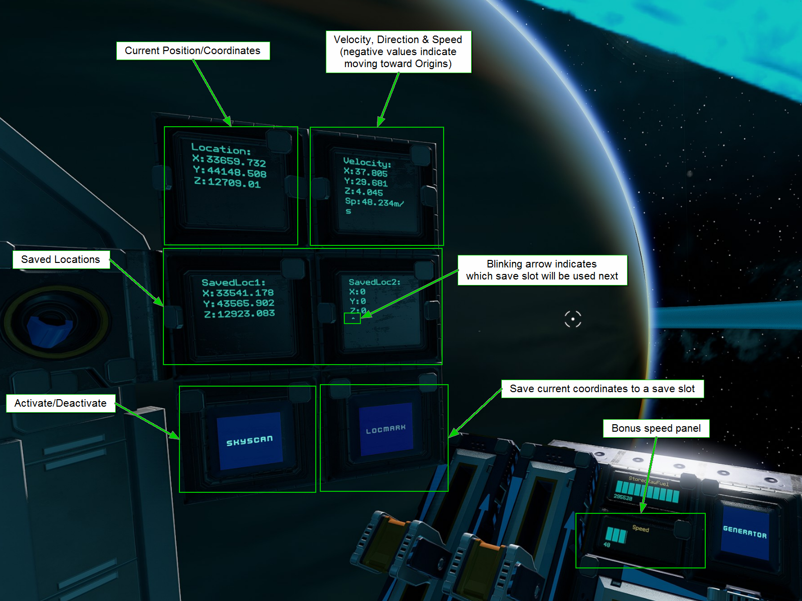
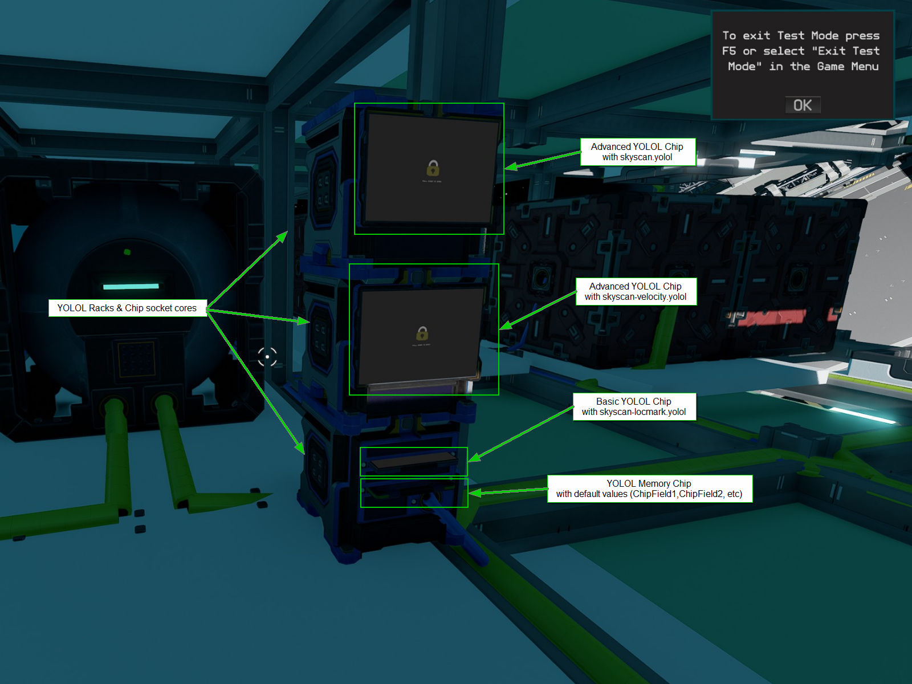
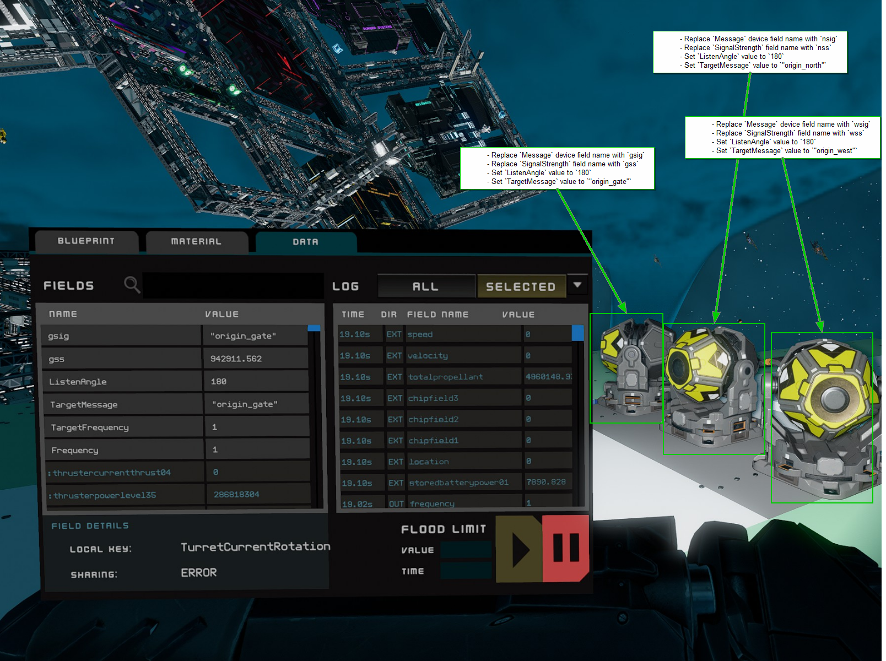

# SKYSCAN - Basic coordinate reference system
This is a proof-of-concept location and coordinate system for Starbase ships. **_It is not meant to replicate or replace ISAN_**, which is a much more comprehensive system and you should probably just use that. ISAN is better than Skyscan in almost every way. In fact, [here's a link to that](https://isan.to/isan.pdf) because that's probably what you want instead. 

## Features
- 3-point coordinate system ✅
- Save up to two locations in memory for reference ✅
- Highly-requested feature: Velocity! ✅

## Limitations
- Probably inaccurate.
- Slow-ish, +2s refresh rate
- Only works up to 1000KM away from Origins
- Ongoing support and updates of this system*  <small>*The author has a full-time job, a newborn baby, and is finishing graduate certificate courses. What little free time is left will probably be spent actually trying to playing the game.</small>

## Installation

### 1. Install controls and display:

- Add a Hybrid Button with 1st device field set to `SkyScan`
    - `ButtonStyle : 1`
- Add a Hybrid Button with 1st device field set to `Locmark`
- Add a Text Panel with 1st device field `Location`
- Add a text panel with 1st device field `Velocity`
- Add a text panel with 1st device field `SavedLoc1`
- Add a text panel with 1st device field `SavedLoc2`

### 2. Install and connect a YOLOL Device Rack according to the following recommended configuration:

- [skyscan.yolol](/skyscan.yolol) on a Basic YOLOL chip:
    - The main SKYSCAN program which controls both the receivers and display output.
- [skyscan-locmark.yolol](LocationMark/skyscan-locmark.yolol) on a Basic YOLOL chip
    - Save up to two locations in long-term memory.
- [skyscan-velocity.yolol](Velocity/skyscan-velocity.yolol) on a Basic YOLOL chip
    - Provides speed and velocity information to panels
- A blank memory chip with default device field names (`ChipField1`, `ChipField2`, etc)

### 3. Install Navigation Receivers

- Place 3 fixed Nav Recievers on hardpoints or turntables, preferably facing different sections of the sky (0°, 120° and 240° are good). Set up each Nav Receiver device fields as follows:
    - Nav Receiver 1
        - `Frequency : 1`
        - `ListenAngle : 180`
        - Replace `Message` device field with `nsig`  
        - Replace `SignalStrength` field with `nss`
        - `TargetMessage : "origin_north"`
        - If on turntable, recommend `TurretRotation : 0`
    - Nav Receiver 2
        - `Frequency : 1`
        - `ListenAngle : 180`
        - Replace `Message` device field with `esig`  
        - Replace `SignalStrength` field with `ess`
        - `TargetMessage : "origin_east"`
        - If on turntable, recommend `TurretRotation : 120`
    - Nav Receiver 3
        - `Frequency : 1`
        - `ListenAngle : 180`
        - Replace `Message` device field with `wsig`  
        - Replace `SignalStrength` field with `wss`
        - `TargetMessage : "origin_west"`
        - If on turntable, recommend `TurretRotation : 240`  

  
## Operation
Press the `SKYSCAN` button to turn on "realtime" scanning and coordinate updates (actually about 2-3 seconds behind your real speed and position. YOLOL is slow, yo. LOL). Your `Location` display will show your relative distance (in KM) from the Origin North, Origin East, and Origin West radio transmitters. If your receivers aren't getting a signal, some of your outputs will show a "0". Turn or rotate your ship until the display catches up.

Press `SKYSCAN` again to turn off and reset (i.e. to save battery/fuel).

Press `LOCMARK` button to save a location to longer-term memory. A blinking caret "`^`" will let you know which slot was last saved to.
